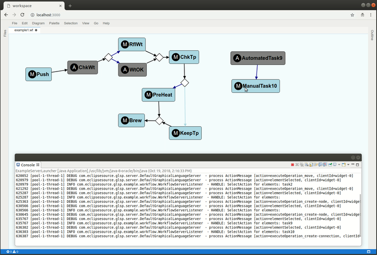

# Graphical Language Server Protocol Framework [](https://travis-ci.org/eclipsesource/graphical-lsp)

The Graphical Language Server Protocol Framework provides extensible components to enable the development of *diagram editors including edit functionality* in (distributed) web-applications via a client-server protocol.
This [Graphical Language Server Protocol (GLSP)](https://github.com/eclipsesource/GraphicalServerProtocol/blob/master/specification.md) is work in progress and developed in collaboration among TypeFox, Obeo, and EclipseSource.
It follows the same architectural pattern as the [Language Server Protocol](https://github.com/Microsoft/language-server-protocol) for textual languages, but applies it to graphical modeling for browser/cloud-based deployments.
The protocol as well as the client implementation is heavily based on [Sprotty](https://github.com/eclipse/sprotty) but extends it with editing functionality and GLSP-specific communication with the server.

Below is a screenshot of a small example diagram being edited in the GLSP client, as well as the server log printing the GLSP actions processed on the server during the current editing session. Click on the image below to see it in action.

[](documentation/glsp-animated-reduced.gif)

For more information, you can also watch the [EclipseCon Europe 2018 talk](https://www.youtube.com/watch?v=snb1UTSH3Zw) or look at [the slides of this talk](https://docs.google.com/presentation/d/e/2PACX-1vS6VlDFPTNGTt7QdwgLZSgF2swXV_qkl9zCXb43dgPYPQRhP-a83eC-Sta54ETMTzhook3S32clXpL9/pub?start=false&loop=false&delayms=3000&slide=id.g120ca87e56_0_4).

## Getting started
### Prerequisites
You’ll need node in version 8:

	curl -o- https://raw.githubusercontent.com/creationix/nvm/v0.33.5/install.sh | bash
	nvm install 8
and yarn

	npm install -g yarn

and lerna

	npm install -g lerna

### Cloning the repository

It's recommended to clone the repository recursively. Otherwise submodules have to be cloned and initialized separatly

    git clone git@github.com:eclipsesource/graphical-lsp.git
    cd graphical-lsp
    
    
### Building the client components
	cd client
	yarn 
	
### Building the server components
	cd server
	mvn clean install
	
### 1. Starting the GLSP Server
Once the server is built, you should have the jar file `server/example/workflow-example/target/workflow-example-X.X.X-SNAPSHOT-glsp.jar` whereas `X.X.X` is the current version. You can now start the server by executing the following commands:

	cd server/example/workflow-example/target
	java -jar workflow-example-X.X.X-SNAPSHOT-glsp.jar com.eclipsesource.glsp.example.workflow.ExampleServerLauncher

To start the example server from within your IDE, run the main method of the class [ExampleServerLauncher.java](https://github.com/eclipsesource/graphical-lsp/blob/master/server/example/workflow-example/src/main/java/com/eclipsesource/glsp/example/workflow/ExampleServerLauncher.java) in the module `server/example/workflow-example`.

### 2. Starting the theia client
Once the server is running, you can go ahead and start the theia client:

	cd client/examples/workflow/browser-app
	yarn start

and then open http://localhost:3000 in the browser.

### Testing the example
The example workspace should be opend automatically on Theia launch. This workspace constains the file "example1.wf". You can display this file in the Workflow Digram editor via context menu (Open with -> Workflow Diagram)

## Contributing to the Graphical LSP project
We'd be thrilled to receive your contribution! Please feel free to open issues, fork this repo, and/or open pull requests. Note that we will ask you to sign a [CLA](https://cla-assistant.io/eclipsesource/graphical-lsp) to ensure all contributions can be distributed under the terms of the following open-source licenses: Apache License 2.0, BSD 2/3 License, MIT License, and Eclipse Public License v2.0.

## Development

### Building in VSCode

The build task *Build all packages* of the VSCode workspace in `client` performs `yarn`. This build task is also marked as the default build task of this workspace. Thus, to perform a full build in VSCode, you can simply click the menu *Terminal --> Run Build Task...*, or press <kbd>Ctrl</kbd> + <kbd>Shift</kbd> + <kbd>B</kbd> (unless you have changed the keybinding for invoking a build in VSCode), or use the command palette task *Tasks: Run Build Task*.

### Watching

To avoid having to perform a full build after each change, you can use the following workflow *in VSCode* to enable watching and automatic rebuilding.

As a prerequisite, perform a full build once (<kbd>Ctrl</kbd> + <kbd>Shift</kbd> + <kbd>B</kbd> or `cd client; yarn`; see above). Now perform the following steps to watch and automatically build on every file change in any package.

1. Start the browser backend: start the launch configuration *Start Browser Backend* by invoking *Debug: Start Debugging*, or by switching to *Debug* perspective and select *Start Browser Backend*, or via the command palette *Tasks: Run Task --> Start Browser Backend for Workflow Example*.
2. Start watching all packages: run the task *Watch all packages* via the command palette *Tasks: Run Task --> Watch all packages* or via the menu *Terminal --> Run Task... --> Watch all packages*.

Alternatively, you can use the *command line* workflow detailed below.

1. Start the browser backend:
   
   ```
   cd client/examples/workflow/browser-app
   yarn start:debug
   ```
2. In a new terminal, invoke the following command to watch all packages:
   
   ```
   cd client
   yarn watch
   ```
